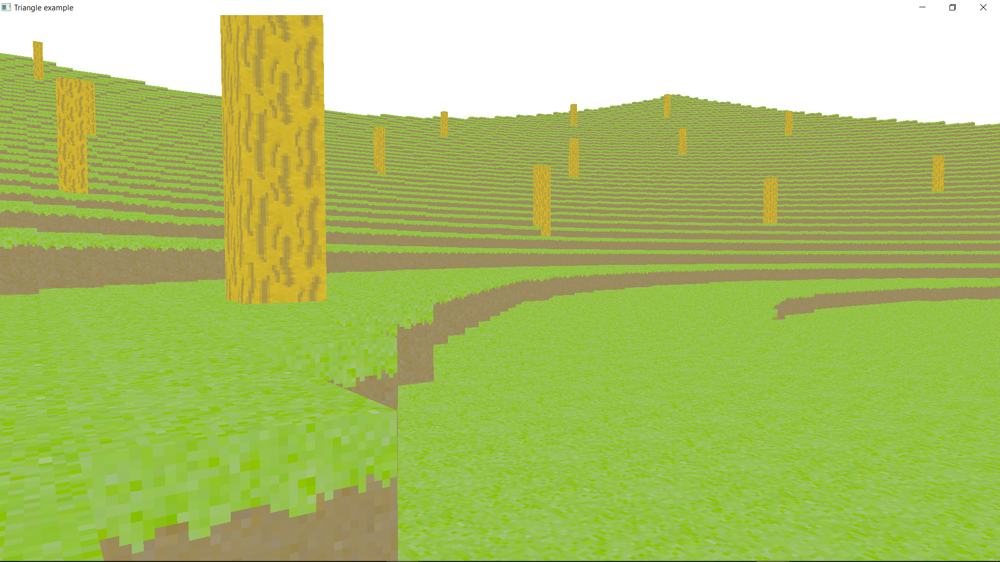

# crowl (temporary name)
Rust voxel engine and game.

Implementation of https://github.com/Technici4n/rust-voxel-game.

## Current state

You can fly in a world full of grass and dirt generated by a basic Perlin noise.
Controls: QZSD to move around, space and shift to move up and down. Press control to increase speed by a factor of 15.
You can play with the CHUNK\_SIZE and the RENDER\_DISTANCE in `main.rs`.

Debug builds are very slow. I think it is because of the integer casts in hot code.
Release builds however perform pretty well.

## Contributing
If you are interested in contributing, the best you can do for now is reviewing the (most probably awful) code or improving and adding 32x32 textures. They are going to be useful in development at some point.
You can also discuss the design of the engine at https://github.com/Technici4n/rust-voxel-game.

## License
The code is under the MIT license, the assets are CC-BY-SA. Texture credits:

Technici4n: _dirt_, _grass\_side_, _grass\_top_

Azercoco: _wood\_side_, _wood\_top_, _leaves_
